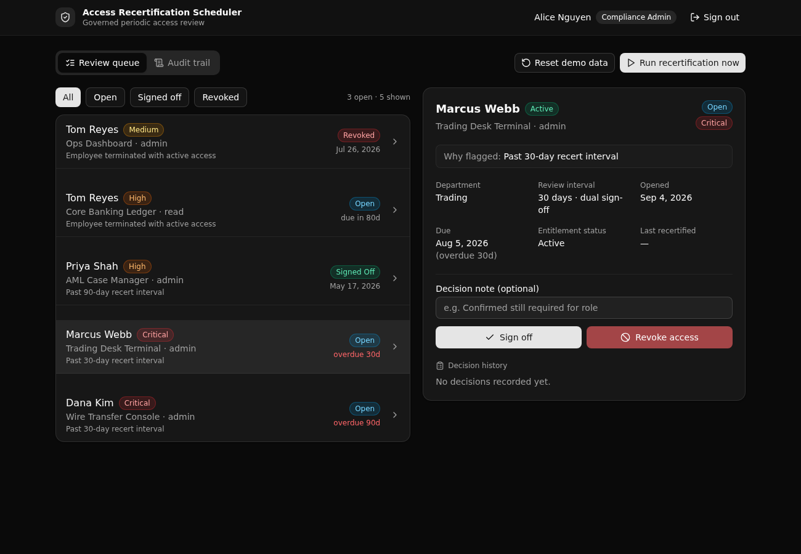

# Access Recertification Scheduler

A governed backend for periodic access recertification. A scheduled scan flags every entitlement past its risk based review interval, opens a role guarded review item, and writes each sign off and revocation to an audit trail a regulator can read.



## What it demonstrates

**Play 2, Backend Modernization**, for financial services and banking compliance. This is the periodic access review a firm runs on spreadsheets and calendar reminders today, moved into one governed Xano backend. The capability on show is a **scheduled task** driving a compliance workflow, with **API layer role based access control** and an **append only audit log**.

The governed job is recertification: who still needs access to what, checked on a fixed cadence by risk tier, with every decision logged. A compliance admin runs the scan, a reviewer signs one entitlement off and revokes another, and a read only viewer can audit the result but cannot act. The business rules live in one API layer a technical evaluator can read and trust.

- **Risk tiered policy.** One `recert_policies` row per tier sets the review interval (critical every 30 days, high 90, medium 180, low 365). The scan reads this table, so the cadence is data, not code.
- **A real review workflow.** An overdue grant opens a review item that can be signed off (which stamps the entitlement as recertified) or revoked (which removes the access). A review that was already actioned cannot be actioned again.
- **Terminated employees.** A terminated employee still holding active access is always flagged, no matter how recently the grant was reviewed.
- **Native API layer RBAC.** Authentication uses a native Xano auth table and `create_auth_token`. Every protected endpoint enforces its role with a precondition, so a viewer calling an action endpoint is refused and a non admin cannot trigger a scan. Access is checked at the API layer, not with row level rules.
- **An idempotent scan.** Running the scan twice does not open duplicate reviews. The same function runs from a manual endpoint and from a daily scheduled task, so the button and the cron enforce identical policy.

**6 tables · 9 endpoints · 1 shared function · 1 scheduled task.**

## Repo layout

```
xano/                     the TypeScript backend (@xanots/sdk)
├── index.ts              the workspace: registers every object below
├── tables/               users, employees, entitlements, recert_policies,
│                         recert_reviews, review_signoffs
├── api/                  the API group (canonical "recert") + 9 endpoints
├── functions/scan.ts     run_recertification_scan, the governed scan
├── tasks/daily-scan.ts   the daily scheduled task that runs the scan
├── seed-data.ts          the demo dataset (one source of truth)
└── xano.lock             pins object identities across deploys (committed)
frontend/                 React + Vite + Tailwind + shadcn/ui
└── src/lib/api.ts        the one contract: paths and types from the query defs
docs/                     the landing page and the screenshot above
```

## API surface

All endpoints live under `api:recert`. Roles rank viewer, then reviewer, then compliance_admin.

| Verb | Path | What it enforces |
| --- | --- | --- |
| POST | `recert/seed` | Open. Resets the demo dataset (truncate, then insert). |
| POST | `recert/auth/login` | Open. Valid credentials only, mints an auth token. |
| GET | `recert/me` | The authenticated user and role. |
| POST | `recert/runs/execute` | Compliance admin only. Runs the scan now. |
| GET | `recert/reviews` | Reviewer or above. Lists reviews, filterable by status. |
| GET | `recert/reviews/{id}` | Reviewer or above. One review with its full context. |
| POST | `recert/reviews/{id}/signoff` | Reviewer or above. Recertify, once per review. |
| POST | `recert/reviews/{id}/revoke` | Reviewer or above. Revoke access, once per review. |
| GET | `recert/audit` | Viewer or above. The append only decision log. |

## Quick start

Go from clone to a live, governed backend in about a minute.

```bash
git clone https://github.com/xano-scratch/access-recertification-scheduler
cd access-recertification-scheduler
npm install
npx xanots login          # authenticate with Xano (one time)
npm run xano:deploy        # builds the frontend, deploys, prints the live URL
```

Open the printed frontend URL, click **Load demo data** on the sign in screen, then sign in as one of the seeded users (password `recert-demo`):

- `alice@bank.example`, compliance admin (runs the scan, reviews, audits)
- `ravi@bank.example`, reviewer (signs off and revokes, audits)
- `val@bank.example`, viewer (read only, audit trail only)

As the admin, press **Run recertification now** to flag overdue access, then open a review to sign it off or revoke it. The audit trail records every decision.

Type check, compile, and deploy separately with `npm run typecheck`, `npm run xano:export`, and `npm run xano:deploy`.

## FAQ

**Is this row level security?** No. Access is enforced at the API layer. Each endpoint names the auth table and checks the caller's role with a precondition before it runs. There is no row level security here.

**Where does the schedule live?** `xano/tasks/daily-scan.ts` registers a scheduled task that runs the scan once a day. It calls the same `run_recertification_scan` function the manual endpoint calls, so both paths enforce the same rules. The manual endpoint is the demo path, so you do not have to wait for the cron to see the workflow.

**Why store a snapshot on the review row?** A review copies the employee name, system, access level, and risk tier as they stood when it was flagged. That keeps the queue and the audit readable without a join, and it means later edits to the source rows do not rewrite history.

**Does the frontend hand type any URLs?** No. `frontend/src/lib/api.ts` derives every request path and every request and response type from the backend query defs. Change a def and the frontend follows at compile time.

**Is the demo data real?** No. It is seeded sample data for a fictional bank. This is an experimental scratch app, not a production system.
